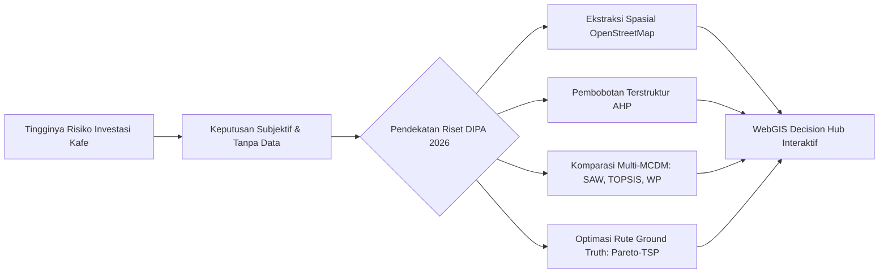
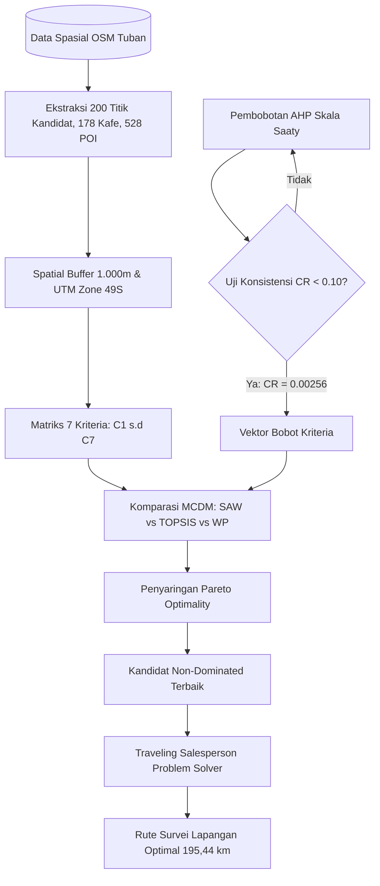

<div align="center">

# 📊 SLIDE PRESENTASI RISET & DOKUMENTASI SISTEM
## Optimasi Pemilihan Lokasi Kafe Menggunakan Data Spasial OpenStreetMap (OSM) & Multi-Criteria Decision Making (MCDM)
### **Hibah Penelitian Internal DIPA Universitas PGRI Ronggolawe (Unirow) Tuban — Tahun Anggaran 2026**

<br>


<br><br>

[](https://andyharyoko.github.io/PenelitianDIPA2026/)
[](https://journal.sanagustin.ac.id/index.php/reimann/article/view/210)
[](https://andyharyoko.github.io/PenelitianDIPA2026/)
[](https://unirow.ac.id)
[](LICENSE)

<br>

> **Sajian Presentasi Slide Eksekutif (Slide Deck / PPT) Hasil Riset & Panduan Sistem Pendukung Keputusan Berbasis Geospasial**

---

</div>

## 📑 DAFTAR ISI SLIDE PRESENTASI

| Slide | Topik Pembahasan | Fokus & Ringkasan |
| :---: | :--- | :--- |
| [**SLIDE 01**](#-slide-01--cover--profil-penelitian) | 🎯 **Cover & Profil Penelitian** | Identitas riset, tim peneliti, dan afiliasi institusi |
| [**SLIDE 02**](#-slide-02--latar-belakang--urgensi-riset) | 💡 **Latar Belakang & Urgensi Riset** | Problem statement, dinamika F&B Tuban, dan solusi GIS-MCDM |
| [**SLIDE 03**](#-slide-03--luaran-penelitian-research-deliverables) | 🏆 **Luaran Penelitian** | Publikasi SINTA 2 Riemann, SnasPPM, HaKI (Arsitektur & Dataflow), WebGIS, & Dataset |
| [**SLIDE 04**](#-slide-04--penjelasan-aplikasi-web-webgis-decision-hub) | 🌐 **Penjelasan Web App** | Arsitektur sistem, tech stack, dan alur komputasi client-side |
| [**SLIDE 05**](#-slide-05--fitur-unggulan-webgis-decision-hub) | 🛠️ **Fitur Unggulan Web App** | 906 POI spasial, editor matriks AHP dinamis, dan analitik multi-MCDM |
| [**SLIDE 06**](#-slide-06--pipeline-metodologi--optimasi-tsp-pareto) | 🚀 **Pipeline Metodologi & TSP-Pareto** | Ekstraksi OSM, AHP-TOPSIS-SAW-WP, Filter Pareto, dan rute survei 195,44 km |
| [**SLIDE 07**](#-slide-07--ucapan-terima-kasih-acknowledgments) | 🙏 **Ucapan Terima Kasih (DIPA 2026)** | Apresiasi resmi atas pendanaan DIPA Unirow 2026 & mitra riset |
| [**SLIDE 08**](#-slide-08--panduan-instalasi--eksekusi-sistem) | 💻 **Panduan Instalasi & Eksekusi** | Langkah menjalankan aplikasi secara lokal dan online |

---

### 🎴 SLIDE 01 | COVER & PROFIL PENELITIAN

<div align="center">
  
</div>

#### 📌 Identitas Program & Hibah
- **Judul Penelitian:** *Optimasi Pemilihan Lokasi Kafe Menggunakan Data Spasial OpenStreetMap (OSM) dan Multi-Criteria Decision Making (MCDM)*
- **Skema Hibah:** Penelitian Internal DIPA Universitas PGRI Ronggolawe (Unirow) Tuban
- **Tahun Anggaran:** 2026
- **Lokasi Fokus:** Kawasan Perkotaan dan Koridor Strategis Kabupaten Tuban, Jawa Timur
- **Live URL WebGIS:** [https://andyharyoko.github.io/PenelitianDIPA2026/](https://andyharyoko.github.io/PenelitianDIPA2026/)

#### 👥 Tim Peneliti & Kolaborator
1. **Andy Haryoko, M.Kom.** *(Ketua Peneliti)* — Program Studi Teknik Informatika, Fakultas Teknik, Universitas PGRI Ronggolawe Tuban (`andyharyoko@gmail.com`)
2. **Suprapto, M.Kom.** *(Anggota Peneliti 1)* — Program Studi Teknik Informatika, Fakultas Teknik, Universitas PGRI Ronggolawe Tuban
3. **Gusti Uripno, M.Pd.** *(Anggota Peneliti 2)* — Program Studi Pendidikan Matematika, FKIP, Universitas PGRI Ronggolawe Tuban
4. **Winda Agustina** *(Kontributor Mahasiswa)* — Program Studi Teknik Informatika, Fakultas Teknik, Universitas PGRI Ronggolawe Tuban

---

### 🎴 SLIDE 02 | LATAR BELAKANG & URGENSI RISET

> [!NOTE]
> **Masalah Utama:** Tingginya tingkat kegagalan bisnis kafe (Food & Beverage) di daerah berkembang akibat penentuan lokasi yang hanya didasarkan pada intuisi subjektif tanpa justifikasi data spasial dan analisis multikriteria yang terukur.



#### 🎯 Poin Kunci Urgensi:
- **Ketersediaan Data Spasial Terbuka (OSM):** Menyediakan ratusan titik data nyata (*point of interest*, kompetitor, dan koridor jalan) yang dapat diekstraksi secara kuantitatif.
- **Kebutuhan Konsistensi Pembobotan (AHP):** Pengambil keputusan membutuhkan skala prioritas kriteria yang teruji secara matematis melalui nilai *Consistency Ratio* ($CR < 0.10$).
- **Kesenjangan Studi Terdahulu:** Sebagian besar riset SPK/GIS berhenti pada tabel perankingan statis tanpa menyediakan verifikasi rute lapangan (*ground-truth route*) dan tanpa antarmuka interaktif yang mudah digunakan oleh pemilik modal maupun perencana tata ruang.

---

### 🎴 SLIDE 03 | LUARAN PENELITIAN (RESEARCH DELIVERABLES)

Sesuai dengan target komitmen Hibah Penelitian Internal DIPA Unirow 2026, penelitian ini telah menghasilkan luaran-luaran komprehensif sebagai berikut:

#### 1. 📚 Publikasi Artikel Jurnal Terakreditasi Nasional (SINTA 2) — Published
- **Judul:** *Pareto-TSP Decision Support Framework for Cafe Location Selection in Tuban Regency*
- **Jurnal:** **Riemann: Research of Mathematics and Mathematics Education**
- **Volume & Halaman:** Vol. 8, No. 2 (2026), Hal. 720–734
- **Indeksasi:** SINTA 2 / Garuda / Google Scholar
- **Tautan Artikel:** [https://journal.sanagustin.ac.id/index.php/reimann/article/view/210](https://journal.sanagustin.ac.id/index.php/reimann/article/view/210)
- **Sitasi RIS:** Tersedia pada berkas [`publikasi_andy_haryoko.ris`](publikasi_andy_haryoko.ris)

#### 2. 📑 Publikasi Prosiding Seminar Nasional (SnasPPM) — On Review
- **Forum:** **Seminar Nasional Penelitian dan Pengabdian Masyarakat (SnasPPM)**
- **Status:** *On Review*
- **Fokus:** Diseminasi hasil implementasi model spasial SPK pemilihan lokasi kafe pada forum ilmiah nasional.

#### 3. 📝 Naskah Publikasi Jurnal Nasional Tambahan (Siap Terbit / Draf)
- **Judul:** *Optimasi Pemilihan Lokasi Kafe Menggunakan Filter Pareto, SAW, AHP-TOPSIS, dan Traveling Salesperson Problem*
- **Target:** Jurnal JATI (Jurnal Mahasiswa Teknik Informatika) / Jurnal Nasional Terakreditasi
- **Draf Naskah:** [`Draft_JATI_Optimasi_Lokasi_Kafe.docx`](Draft_JATI_Optimasi_Lokasi_Kafe.docx)

#### 4. 💡 Kekayaan Intelektual (HaKI / Hak Cipta) — Dalam Proses Pengajuan
Direncanakan pendaftaran Hak Cipta Program Komputer / Karya Tulis Ilmiah untuk Aplikasi WebGIS atau Arsitektur Sistem dan Alur Data:
- 🏛️ **Arsitektur Sistem:** [Diagram Arsitektur WebApp](https://andyharyoko.github.io/PenelitianDIPA2026/diagrams/webapp_architecture.html)
- 🔄 **Alur Data Sistem:** [Diagram Alur Data (Dataflow) WebApp](https://andyharyoko.github.io/PenelitianDIPA2026/diagrams/webapp_dataflow.html)

#### 5. 🌐 Prototipe Produk WebGIS Interaktif (Live Production)
- **Nama Produk:** **WebGIS Decision Hub — Cafe Location Optimization**
- **Akses Langsung:** [https://andyharyoko.github.io/PenelitianDIPA2026/](https://andyharyoko.github.io/PenelitianDIPA2026/)
- **Karakteristik:** *Single-page web application* tanpa beban server (*zero latency client-side execution*) yang dapat diakses melalui laptop, tablet, maupun ponsel cerdas.

#### 6. 📊 Dataset Geospasial Terbuka & Hasil Komparasi Algoritma
- **Dataset Spasial:** 200 Titik Kandidat Kafe, 178 Titik Kafe Eksisting (OSM), 528 Titik POI Strategis Tuban (Sekolah, Kampus, Bank, Rumah Sakit, Mall, Perkantoran).
- **Tabel Benchmark:** [`Tabel_Perbandingan_Metode_Lengkap.csv`](Tabel_Perbandingan_Metode_Lengkap.csv) dan [`Tabel_Top15_Perbandingan.csv`](Tabel_Top15_Perbandingan.csv).

#### 7. 📑 Dokumen Laporan Kemajuan & Laporan Akhir Hibah DIPA
- Draf laporan lengkap meliputi Bab I (Pendahuluan), Bab II (Tinjauan Pustaka), Bab III (Metodologi), dan Bab IV: Hasil yang Dicapai dan Rencana Tahapan Berikutnya ([`Bab_IV_Hasil_dan_Rencana.docx`](Bab_IV_Hasil_dan_Rencana.docx)).

---

### 🎴 SLIDE 04 | PENJELASAN APLIKASI WEB (WEBGIS DECISION HUB)

> [!TIP]
> **Tujuan Aplikasi:** Menjembatani model matematis yang kompleks (AHP, SAW, TOPSIS, WP, TSP) menjadi antarmuka visual interaktif yang intuitif bagi calon pengusaha, pemilik modal, dan perencana tata ruang kota.

```
+-----------------------------------------------------------------------------------+
|                            WEBGIS DECISION HUB ARCHITECTURE                        |
+-----------------------------------------------------------------------------------+
| [PRESENTATION LAYER]                                                              |
|   HTML5 Semantik  *  CSS3 Glassmorphism Modern  *  Responsive Dark/Light UI        |
+-----------------------------------------------------------------------------------+
| [INTERACTIVE MAP LAYER - Leaflet.js]                                              |
|   - 200 Kandidat Lokasi (Blue Circle Markers)                                     |
|   - 178 Kafe Eksisting OSM (Red Markers - Kriteria C4)                            |
|   - 528 POI Strategis (Green Markers - Kriteria C7)                               |
|   - Interactive Spatial Buffer Ring (1.000 Meter Dynamic Overlay)                 |
+-----------------------------------------------------------------------------------+
| [ANALYTICAL & COMPUTATION ENGINE - Vanilla JavaScript Engine]                     |
|   - AHP Engine        : Matriks 7x7 Saaty, Eigenvector, Lambda Max, CI, CR (< 0.10)|
|   - SAW Engine        : Normalisasi Matriks R, Perkalian Bobot V_i                |
|   - TOPSIS Engine     : Matriks Normalisasi Terbobot, Solusi Ideal A+/A-, Relatif |
|   - WP Engine         : Vektor S (Pangkat Bobot Positif/Negatif), Vektor V        |
|   - Pareto-TSP Engine : Filtering Non-Dominated, Rute Survei Lapangan 195,44 km   |
+-----------------------------------------------------------------------------------+
| [DATA VISUALIZATION LAYER - Chart.js]                                             |
|   - Bump Chart (Pergeseran Peringkat)   - Scatter Plot (Biaya Sewa vs Jarak POI)   |
|   - Radar Chart (Profil 7 Kriteria)    - Bar Chart Komparasi Skor Metode          |
+-----------------------------------------------------------------------------------+
```

#### 🌟 Keunggulan Teknis Web App:
1. **Zero-Latency Client-Side Computation:** Seluruh kalkulasi matematis (AHP, SAW, TOPSIS, WP) dijalankan secara instan di sisi peramban (*browser*) pengguna menggunakan Vanilla JavaScript teroptimasi tanpa perlu menunggu respons *backend API*.
2. **Interaktivitas Penuh:** Perubahan bobot preferensi kriteria pada matriks AHP langsung mengubah peringkat rekomendasi dan warna penanda pada peta secara *real-time*.
3. **Portabilitas:** Dapat dijalankan secara *live* melalui GitHub Pages maupun secara *offline* melalui web server lokal sederhana.
4. **Dokumentasi Visual Terintegrasi:** Dilengkapi dengan [Diagram Arsitektur Sistem](https://andyharyoko.github.io/PenelitianDIPA2026/diagrams/webapp_architecture.html) dan [Diagram Alur Data](https://andyharyoko.github.io/PenelitianDIPA2026/diagrams/webapp_dataflow.html).

---

### 🎴 SLIDE 05 | FITUR UNGGULAN WEBGIS DECISION HUB

| Fitur Utama | Deskripsi Fungsionalitas | Manfaat bagi Pengguna |
| :--- | :--- | :--- |
| 🗺️ **Peta Spasial Multi-Layer (906 Titik)** | Integrasi 200 kandidat lokasi, 178 kafe OSM, dan 528 POI dengan kendali *toggle layer* interaktif. | Memetakan distribusi geografis kompetitor dan fasilitas pendorong secara transparan. |
| ⭕ **Buffer Spasial Dinamis 1.000m** | Lingkaran radius 1 km yang muncul otomatis saat penanda kandidat diklik. | Mengukur cakupan pasar potensial dan kepadatan pesaing di sekitar lokasi sasaran. |
| ⚖️ **Editor Matriks AHP Interaktif** | Form perbandingan berpasangan 7 kriteria skala Saaty (1–9) dengan kalkulator otomatis nilai $CR$. | Memastikan preferensi pengambil keputusan selalu rasional dan konsisten ($CR < 10\%$). |
| 📊 **Dashboard Komparasi Multi-MCDM** | Tampilan perbandingan Top 10 metode SAW, TOPSIS, dan WP secara berdampingan. | Memberikan perspektif analitik ganda untuk memitigasi bias satu algoritma. |
| 📈 **Visualisasi Analitik Mendalam** | Grafik *Bump Chart* (perubahan peringkat), *Scatter Plot* korelasi, dan *Radar Chart* profil kriteria. | Mempermudah evaluasi kelebihan dan kelemahan spesifik dari setiap kandidat lokasi. |
| 🚗 **Visualisasi Rute Survei TSP-Pareto** | Peta rute survei lapangan ground truth sepanjang 195,44 km yang menghubungkan kandidat optimal. | Efisiensi biaya dan waktu bagi tim survei lapangan dalam memvalidasi kondisi riil. |

---

### 🎴 SLIDE 06 | PIPELINE METODOLOGI & OPTIMASI TSP-PARETO



#### 📐 7 Kriteria Evaluasi SPK:
- **C1: Aksesibilitas Jalan** *(Benefit)* — Lebar dan klasifikasi jalan di depan kandidat.
- **C2: Kepadatan Penduduk Sekitar** *(Benefit)* — Estimasi populasi dalam radius jangkauan.
- **C3: Biaya Sewa / Nilai Lahan** *(Cost)* — Estimasi beban pengeluaran sewa lokasi.
- **C4: Jarak ke Kompetitor Kafe** *(Cost / Jarak)* — Jarak menuju kafe pesaing terdekat.
- **C5: Ketersediaan Lahan Parkir** *(Benefit)* — Kapasitas parkir kendaraan roda 2 dan 4.
- **C6: Visibilitas Lokasi** *(Benefit)* — Kemudahan pandang lokasi dari jalur lalu lintas utama.
- **C7: Kedekatan Fasilitas Publik / POI** *(Benefit)* — Jumlah kampus, sekolah, kantor, bank, dan RS dalam radius 1 km.

---

### 🎴 SLIDE 07 | UCAPAN TERIMA KASIH (ACKNOWLEDGMENTS)

<div align="center">
  
</div>

> [!IMPORTANT]
> ### 🏛️ Pernyataan Apresiasi & Ucapan Terima Kasih
> 
> **Tim Peneliti menyampaikan rasa syukur dan ucapan terima kasih yang sebesar-besarnya kepada:**
> 
> 1. **Lembaga Penelitian dan Pengabdian kepada Masyarakat (LPPM) Universitas PGRI Ronggolawe (Unirow) Tuban**, atas kepercayaan, arahan, dan dukungan pendanaan penuh yang diberikan melalui skema **Hibah Penelitian Internal DIPA Unirow Tahun Anggaran 2026**.
> 2. **Rektor dan Jajaran Pimpinan Universitas PGRI Ronggolawe Tuban**, atas kebijakan strategis yang senantiasa mendorong penguatan iklim riset, inovasi teknologi, dan hilirisasi produk iptek di lingkungan kampus.
> 3. **Dekan Fakultas Teknik dan Dekan Fakultas Keguruan dan Ilmu Pendidikan (FKIP) Unirow Tuban**, atas fasilitas sarana, prasarana, laboratorium komputasi, dan dukungan administratif yang diberikan sepanjang pelaksanaan riset.
> 4. **Seluruh Sivitas Akademika, Rekan Sejawat Dosen, dan Mahasiswa**, yang telah berkontribusi aktif dalam pengumpulan data lapangan, diskusi metodologi, validasi prototipe WebGIS, dan penyusunan publikasi ilmiah.
> 
> *Semoga hasil penelitian ini memberikan kontribusi nyata bagi pengembangan ilmu pengetahuan, penguatan metodologi sistem pendukung keputusan spasial, serta menjadi panduan bermanfaat bagi kemajuan sektor ekonomi kreatif dan F&B di Kabupaten Tuban dan sekitarnya.*

---

### 🎴 SLIDE 08 | PANDUAN INSTALASI & EKSEKUSI SISTEM

#### 🌐 1. Akses Online (Langsung tanpa instalasi)
Aplikasi WebGIS sudah di-deploy dan dapat langsung dibuka melalui tautan berikut:
👉 **[https://andyharyoko.github.io/PenelitianDIPA2026/](https://andyharyoko.github.io/PenelitianDIPA2026/)**

#### 💻 2. Eksekusi Lokal (Offline / Development)
Untuk menjalankan aplikasi di komputer lokal:

```bash
# 1. Clone repositori ke komputer Anda
git clone https://github.com/andyharyoko/PenelitianDIPA2026.git
cd PenelitianDIPA2026

# 2. Masuk ke direktori aplikasi web
cd webapp

# 3. Jalankan web server lokal ringan (Python 3)
python3 -m http.server 8085
```

Buka peramban favorit Anda dan akses alamat:
👉 **`http://localhost:8085/`**

*(Catatan: Anda juga dapat membuka berkas `webapp/index.html` secara langsung dengan klik dua kali).*

#### 📁 Struktur Berkas Repositori:
```
PenelitianDIPA2026/
├── Banner dipa.jpg.jpeg                 # Banner Resmi Hibah Penelitian DIPA Unirow 2026
├── README.md                            # Sajian Slide Presentasi (PPT) & Dokumentasi Proyek
├── Bab_IV_Hasil_dan_Rencana.docx        # Laporan Kemajuan Hasil & Rencana Tahapan Riset
├── Draft_JATI_Optimasi_Lokasi_Kafe.docx # Draf Publikasi Jurnal Terkait
├── publikasi_andy_haryoko.ris           # Data Sitasi RIS Publikasi Jurnal Riemann SINTA 2
├── webapp/                              # Kode Sumber WebGIS Decision Hub
│   ├── index.html                       # Antarmuka Utama WebGIS
│   ├── css/                             # Sistem Desain Modern (Glassmorphism, Light/Dark)
│   ├── js/                              # Logika Komputasi Spasial, AHP, MCDM, Leaflet, Chart.js
│   ├── data/                            # Dataset Spasial 200 Kandidat, 178 Kafe, 528 POI
│   └── diagrams/                        # Diagram Arsitektur & Alur Data WebApp
│       ├── webapp_architecture.html     # Visualisasi Interaktif Arsitektur Sistem (HaKI)
│       └── webapp_dataflow.html         # Visualisasi Interaktif Alur Data Sistem (HaKI)
├── TSP-Pareto/                          # Modul Penelitian Lanjutan Pareto & TSP
│   ├── run_pareto_tsp_spk.py            # Script Komputasi Pareto-TSP
│   ├── generate_pareto_charts.py        # Pembuat Grafik Komparasi Pareto
│   └── peta_rute_tsp_pareto.html        # Peta Visualisasi Rute TSP
├── data_kandidat_kafe.csv               # Dataset Mentah 100-200 Titik Kandidat
├── spk_ahp_topsis.py                    # Script Algoritma AHP-TOPSIS Python
├── spk_saw.py                           # Script Algoritma SAW Python
└── Tabel_Perbandingan_Metode_Lengkap.csv# Data Hasil Perankingan Komparatif
```

---

<div align="center">
  <p><b>Universitas PGRI Ronggolawe (Unirow) Tuban &copy; 2026</b><br>
  <i>Program Studi Teknik Informatika &bull; Program Studi Pendidikan Matematika</i></p>
</div>
